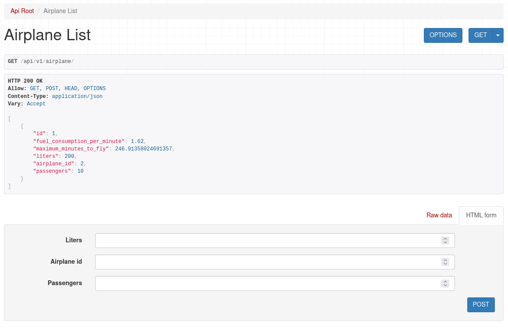

# Demo Page


# Setup
Get Project from Git
```sh
git clone https://github.com/akashdobariya2702/ZipAirlines.git
```

# Installation and Run Server
This will setup virtual environment, install packages and run the server using `settings.py` file
```sh
source dj_run.sh
```

# Now you can test website
Open http://127.0.0.1:8000/api/v1/airplane/ URL in the brower (ex. Chrome)

# Test Server
This will test the server.
```sh
python manage.py test
```
